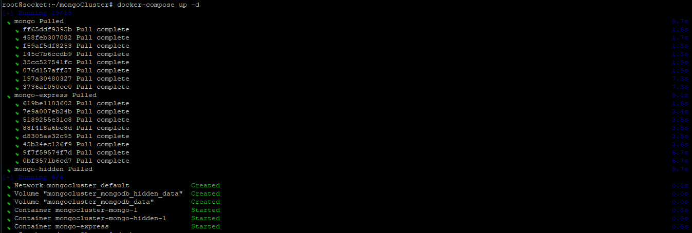
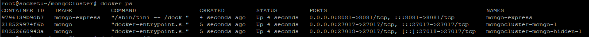
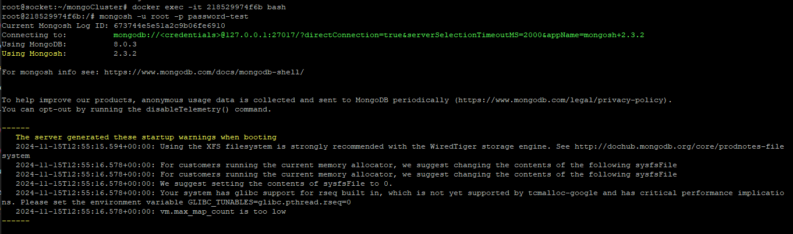
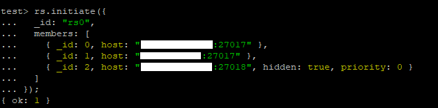
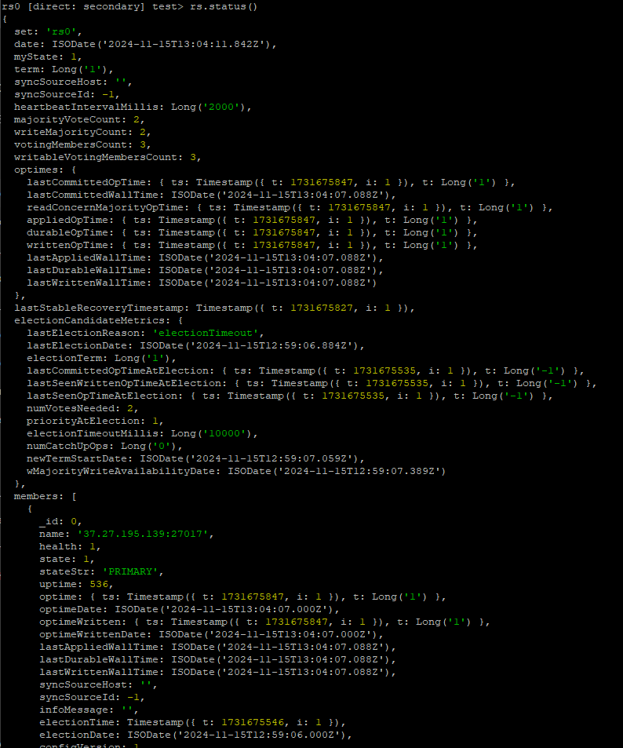

# MongoDB Clustering with Docker

## Table of Contents
1. [Introduction](#introduction)
2. [Requirements](#requirements)
3. [Setup Primary Server](#setup-primary-server)
4. [Setup Secondary Servers](#setup-secondary-servers)
5. [Initialize Replica Set](#initialize-replica-set)

---

## Introduction
This guide explains how to set up a **MongoDB cluster** using Docker and Docker Compose. The cluster includes:
- A primary node
- A secondary node
- An optional hidden node for voting and fault tolerance.

---

## Requirements
Before proceeding, ensure you have:
1. At least two servers (three recommended for fault tolerance).
2. Necessary ports opened on all servers:
   - Default MongoDB port: `27017`
   - Secondary/hidden port: `27018`
   - Mongo Express UI: `8081`
3. Installed tools:
   - Docker
   - Docker Compose
   - OpenSSL for generating key files.

---

## Setup Primary Server

### 1. Create Project Directory
Run the following commands to create a directory for the cluster setup:
```bash
mkdir mongoCluster
cd mongoCluster
```

### 2. Create Required Files
Inside the `mongoCluster` directory, create the following files:
- `docker-compose.yml`
- `.env`
- `mongo-keyfile`

### 3. Populate Files

#### `docker-compose.yml`
```yaml
services:
  mongo:
    image: mongo
    restart: always
    environment:
      MONGO_INITDB_ROOT_USERNAME: ${MONGO_INITDB_ROOT_USERNAME}
      MONGO_INITDB_ROOT_PASSWORD: ${MONGO_INITDB_ROOT_PASSWORD}
    command: mongod --bind_ip_all --replSet "${REPLSET_NAME}" --keyFile ${MONGO_KEYFILE_PATH}
    volumes:
      - mongodb_data:/data/db
      - ./mongo-keyfile:${MONGO_KEYFILE_PATH}
    ports:
      - "${MONGO_PORT}:${MONGO_PORT}"

  mongo-express:
    image: mongo-express
    ports:
      - "8081:8081"
    environment:
      ME_CONFIG_MONGODB_SERVER: mongo
      ME_CONFIG_MONGODB_PORT: ${MONGO_PORT}
      ME_CONFIG_MONGODB_ADMINUSERNAME: ${MONGO_INITDB_ROOT_USERNAME}
      ME_CONFIG_MONGODB_ADMINPASSWORD: ${MONGO_INITDB_ROOT_PASSWORD}
    depends_on:
      - mongo

  # If you don't want to use three servers. Activate this section on one of the servers
  mongo-hidden:
    image: mongo
    restart: always
    environment:
      MONGO_INITDB_ROOT_USERNAME: ${MONGO_INITDB_ROOT_USERNAME}
      MONGO_INITDB_ROOT_PASSWORD: ${MONGO_INITDB_ROOT_PASSWORD}
    command: mongod --bind_ip_all --replSet "${REPLSET_NAME}" --keyFile ${MONGO_KEYFILE_PATH}
    volumes:
      - mongodb_hidden_data:/data/db
      - ./mongo-keyfile:${MONGO_KEYFILE_PATH}
    ports:
      - "${HIDDEN_PORT}:${MONGO_PORT}"

volumes:
  mongodb_data:
  mongodb_hidden_data:
```

#### `.env`
```env
MONGO_INITDB_ROOT_USERNAME=root
MONGO_INITDB_ROOT_PASSWORD=password-test
REPLSET_NAME=rs0
MONGO_PORT=27017

# If you don't want to use three servers. Activate this section on one of the servers
HIDDEN_PORT=27018

MONGO_KEYFILE_PATH=/data/configdb/mongo-keyfile
```

#### `mongo-keyfile`
Generate a secure key using the following commands:
```bash
openssl rand -base64 756 > mongo-keyfile
chmod 600 mongo-keyfile
```

### 4. Start the Cluster
Run the following command to start the MongoDB cluster:
```bash
docker-compose up -d
```



---

## Setup Secondary Servers
Repeat the following steps on the secondary servers:
1. Copy the `mongo-keyfile` from the primary server:
   ```bash
   scp primary-server:/path/to/mongo-keyfile ./mongo-keyfile
   chmod 600 mongo-keyfile
   ```
2. Use the same `docker-compose.yml` and `.env` files (adjust the IPs if necessary).
3. Start the containers:
   ```bash
   docker-compose up -d
   ```

---

## Initialize Replica Set
On the primary server, follow these steps:

### 1. Get Docker Container ID
Run the following command to list running containers:
```bash
docker ps
```



Find the `CONTAINER ID` of the primary MongoDB container.

### 2. Enter MongoDB Container
```bash
docker exec -it <CONTAINER_ID> bash
```

### 3. Access MongoDB Shell
```bash
mongosh -u root -p password-test
```


### 4. Initialize Replica Set
Run the following command in the MongoDB shell:
```javascript
rs.initiate(
  {
    _id: "rs0",
    members: [
      { _id: 0, host: "first-server-ip:27017" },
      { _id: 1, host: "second-server-ip:27017" },
      { _id: 2, host: "third-server-ip:27018", hidden: true, priority: 0 }
    ]
  }
)
```



**Note:** You can see the general status of the database with the rs.status() command.


**Note:** Adjust the IP addresses and ports according to your setup.

---

Now your MongoDB cluster is up and running with high availability and fault tolerance.

### Author

[Kambiz Shahriarynasab]\
[[saiprogrammerk@gmail.com](mailto:saiprogrammerk@gmail.com)]\
[[https://t.me/pr_kami](https://t.me/pr_kami)]\
[https://www.instagram.com/pr.kami.sh/]\
[[https://www.youtube.com/channel/UCqjjdsFRXliDa7K612BZtmA](https://www.youtube.com/channel/UCqjjdsFRXliDa7K612BZtmA)]\
[https://www.linkedin.com/public-profile/settings?trk=d_flagship3_profile_self_view_public_profile]

#### Disclaimer
The author of this project assumes no responsibility for any issues, damages, or losses that may arise from the use of this code. The project is provided "as is" without any warranties, including but not limited to functionality, security, or suitability for a particular purpose. Users should thoroughly test and verify the implementation in their own environments before deploying it in production.

